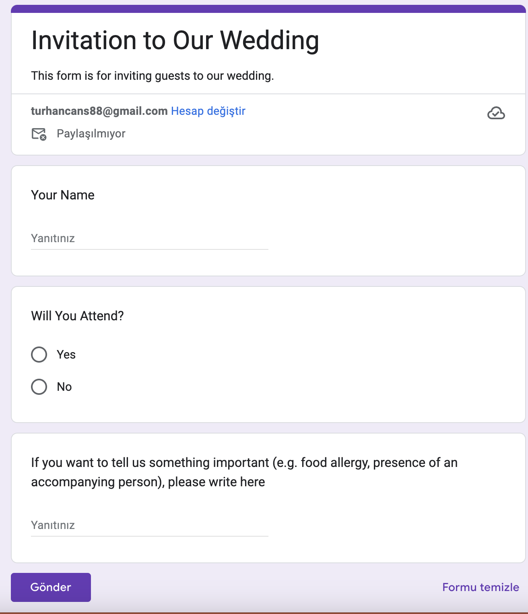
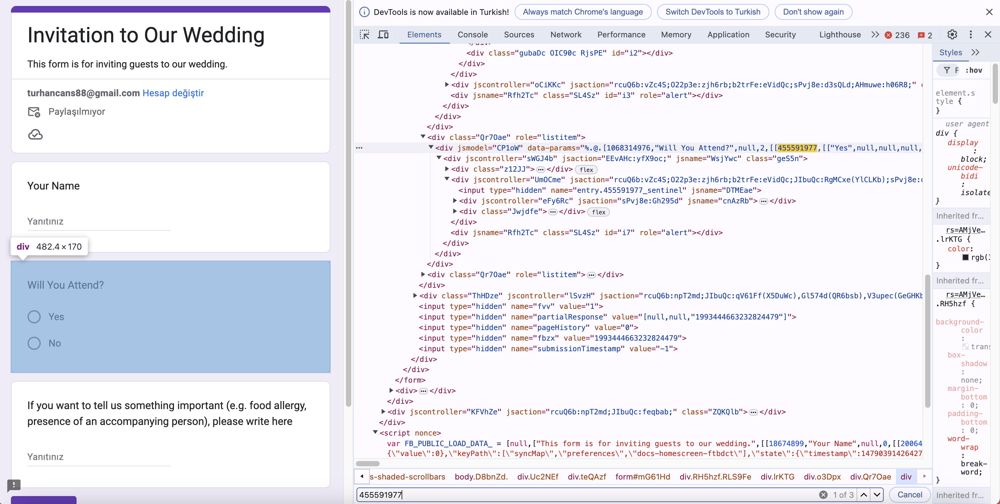

# Wedding Invitation Website

This is a Flask-based web application for managing wedding invitations. Guests can confirm their attendance through a Google Form embedded in the website.

## Features

- Personalized invitation pages for each guest.
- Integration with Google Forms for attendance confirmation.
- Easy customization for different weddings.

## Project Structure
```
wedding-invitation
│
├── requirements.txt       # Dependencies for Heroku
├── guests.json            # List of guests
├── Procfile               # Heroku deployment file
├── runtime.txt            # Python version for Heroku
├── environment.yml        # Conda environment file
├── README.md              # Project documentation
├── app.py                 # Main application file
├── .env                   # Environment variables
├── LICENSE                # License information
├── .gitignore             # Files and directories to be ignored by Git
├── templates/             # HTML templates
│   ├── home.html
│   ├── guest.html
│   ├── confirmation.html
│   └── 404.html
└── static/
    └── css/
        └── style.css      # Custom CSS
    └── img/               # Images
```

## Getting Started

### Installation

1. Clone the repository:

```sh
git clone https://github.com/turhancan97/wedding-invitation.git
cd wedding-invitation
```

2. Install the dependencies:

```sh
conda env create -f environment.yml
conda activate wedding-invitation
```

3. Create a .env file and set the following environment variables:

```sh
GOOGLE_FORM_ID = 'YOUR_GOOGLE_FORM_ID'
GOOGLE_FORM_NAME_FIELD = 'YOUR_GOOGLE_FORM_NAME_FIELD'
GOOGLE_FORM_ATTENDANCE_FIELD = 'YOUR_GOOGLE_FORM_ATTENDANCE_FIELD'
GOOGLE_FORM_OTHER_FIELD = 'YOUR_GOOGLE_FORM_OTHER_FIELD'
```

3.1. How to create Google Form:

1. Go to [Google Forms](https://docs.google.com/forms/u/0/).
2. Open empty form
3. Make your form something like below:



3.2. How to get Google Form ID and Field Names:

1. Click on the send button and get the link of the form.
2. The link will be like below:

```
https://docs.google.com/forms/d/e/1FAIpQLSdi897ORN2YPNSvG7Yagh1yRN1KKDJU5ORbdNZQ9KrHYfjqqg/viewform
```
3. The ID of the form is the part after `/d/` and before `/viewform`. In this case, the ID is `1FAIpQLSdi897ORN2YPNSvG7Yagh1yRN1KKDJU5ORbdNZQ9KrHYfjqqg`.

4. The field names are the names of the fields in the form.
5. You can find the field names by inspecting the form. Right-click on the field and click on inspect. You can see example below:



6. Create a `guests.json` file with the following structure:

```json
[
    "John",
    "Jane",
    "Uncle_Bob",
    "Aunt_Mary",
    "Mr_Smith",
    "Mrs_Smith",
    "Billy_with_an_other_person",
    "Sally_Gordon"
]
```

5. Run the application locally:

```sh
python app.py
```

6. Deploy the application to Heroku (check the [Heroku documentation](https://devcenter.heroku.com/articles/getting-started-with-python)):

```sh
heroku login
git add .
git commit -am "make it better"
git push heroku main
```

7. Customization:

* **HTML Templates:** Modify the HTML templates in the templates directory to customize the look and feel of the website. There are spots for you to add your own images (**PUT A IMAGE OF YOURS HERE**), such as your designed invitation card. Replace the placeholders with the URLs of your images.
* **CSS:** You can update static/css/style.css to change the styling.
* **Guest List:** Update the guests.json file with the names of your guests.
* The function adjust_name in the app.py file is used to adjust the names in the guests.json file to be used in the URL. You can modify this function to adjust the names as you like.
* You can buy a domain and link it to your Heroku app to have a custom domain for your wedding website. I recommend using [Namecheap](https://www.namecheap.com/) for buying domains.

## Contributing

Feel free to fork this repository and make your own enhancements. Pull requests are welcome.

## License

This project is licensed under the MIT License - see the [LICENSE](LICENSE) file for details.